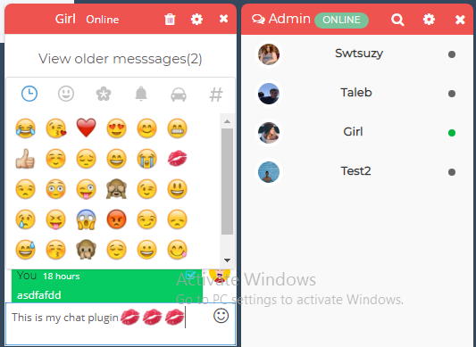
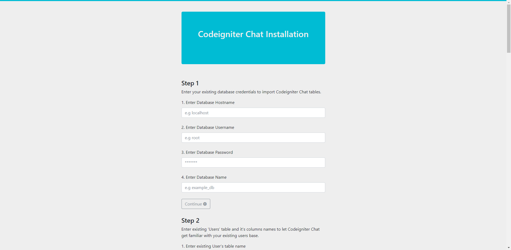
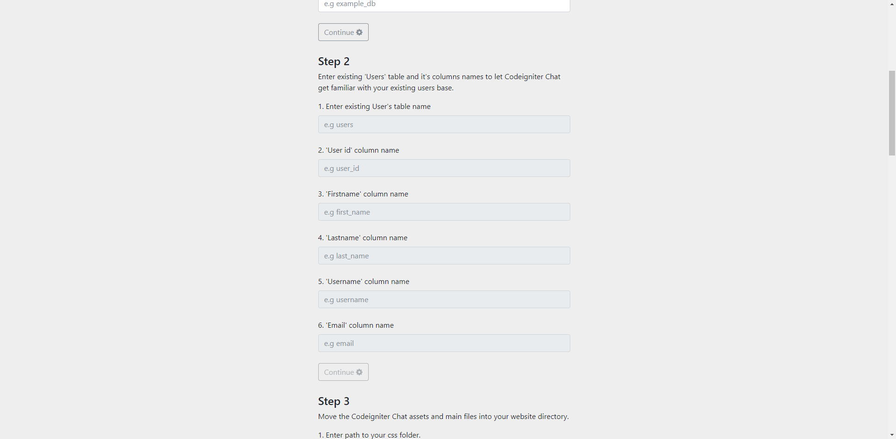
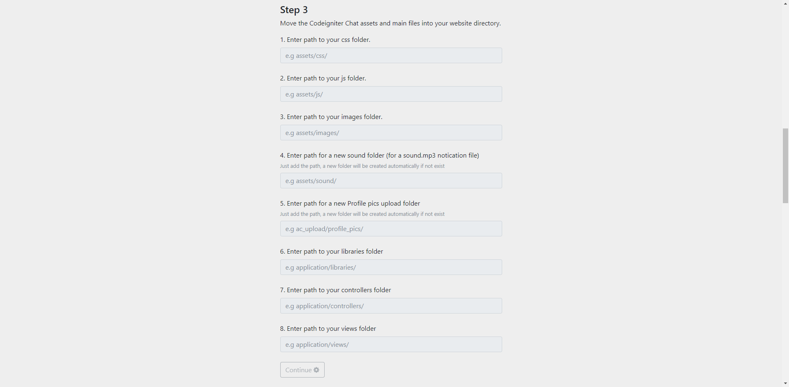
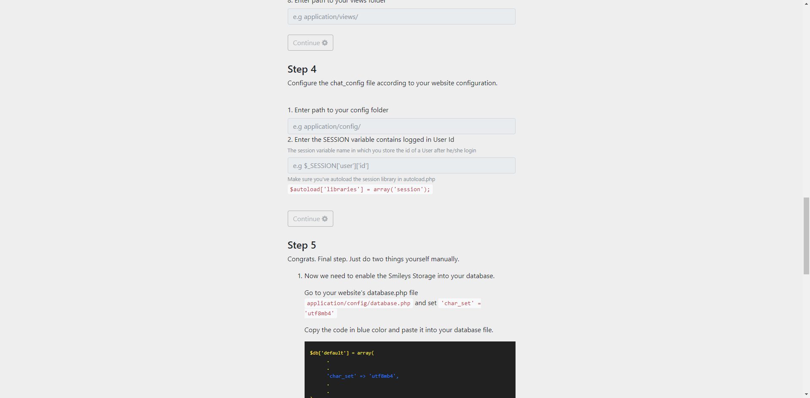
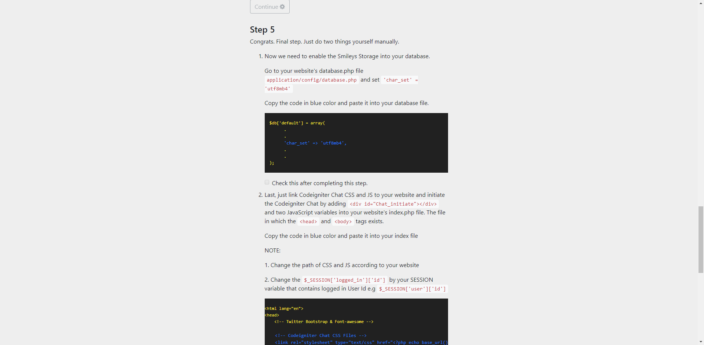
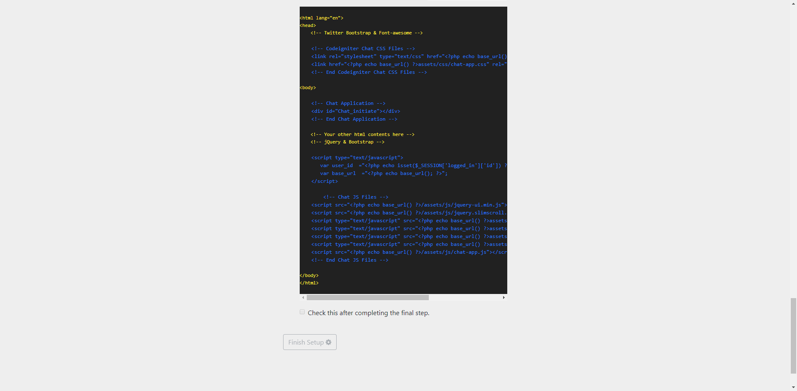
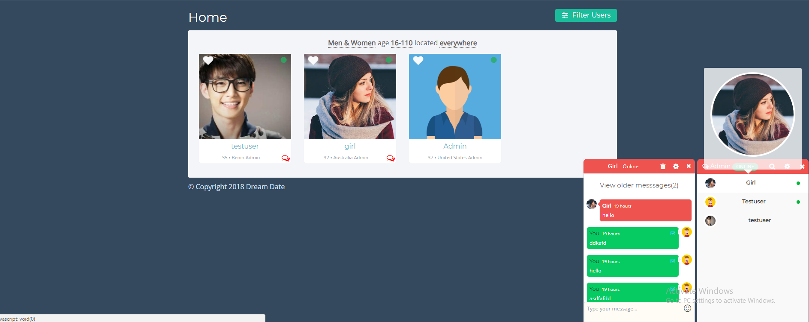
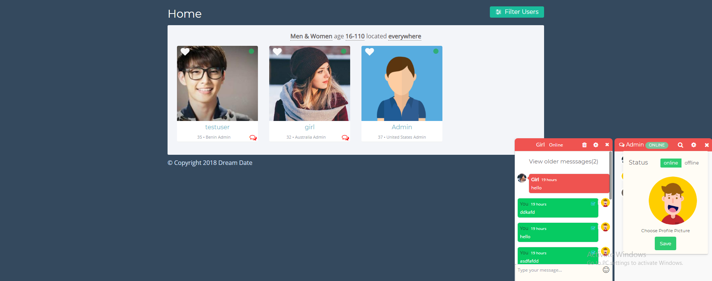

A Realtime chatting system that can be easily integrate into any Codeigniter website.
   

 
 
 
 
Now you can integrate Chat using installer. 

1. Smiley Support
2. User Blocking
3. User Searching
4. Message seen or not
5. Profile Picture Upload
6. Delete Chat History
7. Improved Design
8. Improved Performance & Scalability

## Feature 

We are working on Chat and it's coming with **Web Sockets** integration which will make the chating experience more smooth.

1. Real time Chatting
2. Chat with multiple user at a time
3. Fully responsive and Mobile optimized
4. Works with your existing user database
5. Works with your user login system
6. Looks beautiful with your existing theme
7. Light weight and scalable
8. Supports HMVC architecture
 

## How to integrate into existing website

Just follow the below simple baby steps to integrate Chat into your existing website. We have make the installer more smart.

**Requirements**

1. PHP >= 5.6.0
2. Mysql >= 5.5
3. Existing Codeigniter website with user login functionality
4. Twitter Bootstrap
5. Fontawesome
6. Jquery

**Installation**
  

 

 

 

 

 

 
   
1. Create the "chatinstaller" folder and move it near your website's application folder. E.g 
    -> application 
    -> chatinstaller 
    -> system 

    NOTE: Please change the name of 'chatinstaller' folder to 'chat_installer

2. Now go to URL- 
    -> codeigniter_site.com/chat_installer or 
    -> localhost/codeigniter_demo/chat_installer

**Configuration** 

Now you can customize Chat fully according to your website from one place. 
After installation, go to 
    -> codeigniter_site/application/config/chat_config.php
**After install site** 
   
 

 

 

